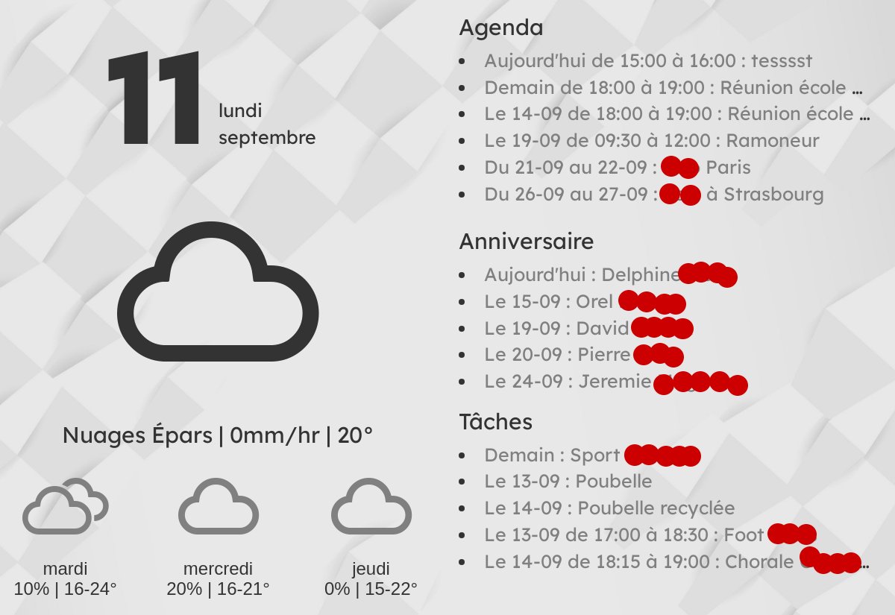

# Original project
Forked from https://github.com/speedyg0nz/MagInkDash

# Change
- Bitweather replaces OpenWeatherMap, requiring no CB registration
- ChatGPT removed and replaced by Google Contact birthdays
- Added a second calendar

# MagInkDash-v2
This repo contains the code needed to drive an E-Ink Magic Dashboard that uses a Raspberry Pi to automatically retrieve updated content from Google Calendar and BitWeather, format them into the desired layout, before serving it to a battery powered E-Ink display (Inkplate 10). Note that the code has only been tested on the specific hardware mentioned, but can be easily modified to work with other hardware (for both the server or display).


## Hardware Required
- A server ( raspberry?) to retrieve content and generate a dashboard for the E-Ink display so any model would do. Personally, I dug out an old Raspberry Pi Model B Revision 2.0 from 2011 and it works fine for this purpose. In fact, it doesn't even need to be a RPi. Any other Single Board Computer, or old computer, or even a cloud service that runs the code would suffice.
- [Inkplate 10 Battery Powered E-Ink Display](https://soldered.com/product/soldered-inkplate-10-9-7-e-paper-board-with-enclosure-copy/) - Used as a client to display the generated dashboard. I went with this because it was an all-in-one with the enclosure and battery included so there's less hardware tinkering. But you could certainly go barebones and assemble the different parts yourself from scratch, i.e. display, microcontroller, case, and battery.


## How It Works
A cron job on RPi will trigger a Python script to run every hour to fetch calendar events from Google Calendar, weather forecast from Bitweather. The retrieved content is then formatted into the desired layout and saved as an image. An Apache server on the server will then host this image such that it can be accessed by the Inkplate 10. On the Inkplate 10, the corresponding script   will then connect to the server on the local network via a WiFi connection, retrieve the image and display it on the E-Ink screen. The Inkplate 10 then goes to sleep to conserve battery. The dashboard remains displayed on the E-Ink screen, because well, E-Ink...

Some features of the dashboard: 
- **Battery Life**: As with similar battery powered devices, the biggest question is the battery life. I'm currently using a 1500mAh battery on the Inkplate 10 and based on current usage, it should last me around 3-4 months. With the 3000mAh that comes with the manufacturer assembled Inkplate 10, we could potentially be looking at 6-8 month battery life. With this crazy battery life, there are much more options available. Perhaps solar power for unlimited battery life? Or reducing the refresh interval to 15 or 30min to increase the information timeliness?
- **Calendar and Weather**: I'm currently displaying calendar events and weather forecast for current day and the upcoming two days. No real reason other than the desire to know what my weekend looks like on a Friday, and therefore helping me to better plan my weekend. Unfortunately, if you have a busy calendar with numerous events on a single day, the space on the dashboard will be consumed very quickly. If so, you might wish to modify the code to reduce/limit the number of days/events to be displayed.
- **Telegram Bot**: Although the battery life is crazy long on the Inkplate 10, I still wish to be notified when the battery runs low. To do so, I set up a Telegram Bot and the Inkplate will trigger the bot to send me a message if the measured battery voltage falls below a specified threshold. That said, with the bot set up, there's actually much more you could do, e.g. send yourself a message when it's to expected to rain in the next hour.

## Setting Up 

1. Run the following commands on the server  to setup the environment to run the Python scripts and function as a web server. It'll take some time so be patient here.

```bash
sudo apt update
sudo apt-get install python3-pip
sudo apt-get install chromium-chromedriver
sudo apt-get install libopenjp2-7-dev
pip3 install --upgrade google-api-python-client google-auth-httplib2 google-auth-oauthlib
pip3 install pytz
pip3 install selenium
pip3 install Pillow
pip3 install openai  
sudo apt-get install apache2 -y  
sudo chown pi:www-data /var/www/html
sudo chmod 755 /var/www/html
```
4. Download the over the files in this repo to a folder in your PC first. 

5. In order for you to access your Google Calendar events, it's necessary to first grant the access. Follow the [instructions here](https://developers.google.com/calendar/api/quickstart/python) on your PC to get the credentials.json file from your Google API. Don't worry, take your time. I'll be waiting here.

6. Once done, copy the credentials.json file to the "gcal" folder in this project. Navigate to the "gcal" folder and run the following command on your PC. A web browser should appear, asking you to grant access to your calendar. Once done, you should see a "token.pickle" file in your "gcal" folder.

```bash
python3 quickstart.py
```

7. Copy all the files (other than the "inkplate" folder) over to your server using your preferred means. 

8. Run the following command in the RPi Terminal to open crontab.
```bash
crontab -e
```
9. Specifically, add the following command to crontab so that the MagInkDash Python script runs on the hour, every hour.
```bash
0 * * * * cd /location/to/your/MagInkDash && python3 main.py
```
10. As for the Inkplate, I'm not going to devote too much space here since there are [official resources that describe how to set it up](https://inkplate.readthedocs.io/en/latest/get-started.html). It may take some trial and error for those new to microcontroller programming but it's all worth it! Only the Arduino portion of the guide is relevant, and you'll need to be able to run *.ino scripts via Arduino IDE before proceeding. From there, run the "inkplate.ino" file from the "inkplate" folder from the Arduino IDE when connected to the Inkplate.

12. That's all! Your Magic Dashboard should now be refreshed every hour! 


## Acknowledgements
- [Lexend Font](https://fonts.google.com/specimen/Lexend) and [Tilt Warp Font](https://fonts.google.com/specimen/Tilt+Warp): Fonts used for the dashboard display
- [Bootstrap](https://getbootstrap.com/): Styling toolkit to customise the look of the dashboard
- [Weather Icons](https://erikflowers.github.io/weather-icons/): Icons used for displaying of weather forecast information
- [Freepik](https://www.freepik.com/): For the background image used in this dashboard
  
